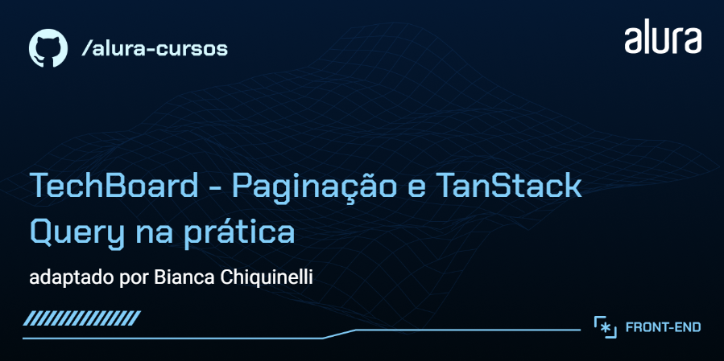

# Tecboard | Hub de Eventos de Tecnologia



Aplicação web para gerenciamento e navegação por eventos de tecnologia, desenvolvida para oferecer uma experiência fluida de busca, filtragem por categorias e cadastro de novos eventos.

---

## 🚀 Engenharia e Decisões Técnicas

O projeto foi construído focando em boas práticas de desenvolvimento frontend, gerenciamento assíncrono eficiente e validação de dados em tempo real:

- **Gerenciamento de Estado Assíncrono:** Uso do **TanStack Query (React Query)** para consumo da API REST, reduzindo requisições desnecessárias através de _caching_ e otimizando a navegação com _Infinite Queries_ e paginação controlada.
- **Formulários e Performance:** Integração do **React Hook Form** com **Zod** (via `zodResolver`), garantindo validação baseada em schemas sem re-renderizações desnecessárias.
- **Interface e Design System:** Configuração de tema global via **Material UI (MUI)**, utilizando `ThemeProvider` e `CssBaseline` para padronização visual, responsividade e coerência nos componentes.
- **Ferramental e DX:** Build rápido com **Vite**, monitoramento de estado assíncrono via **TanStack DevTools** e simulação de API REST com **JSON Server**.

---

## 🛠️ Tecnologias Utilizadas

- **Core:** React 19, Vite
- **Estado & Requisições:** TanStack Query (React Query), Axios
- **Formulários & Validação:** React Hook Form, Zod, `@hookform/resolvers`
- **UI & Estilização:** Material UI (MUI), Emotion
- **Qualidade & Mock API:** ESLint, JSON Server, TanStack DevTools

---

## ⚡ Funcionalidades

- **Listagem:** Exibição responsiva de cards de eventos categorizados (Front-end, Design, Back-end).
- **Paginação e Infinite Scroll:** Navegação paginada com controle de estado e carregamento progressivo de eventos via _Infinite Query_.
- **Cadastro Otimizado de Eventos:** Formulário com validação em tempo real, tipos estritamente definidos e feedback de erro claro.
- **Mutações de API (`EventMutation`):** Envio e atualização de dados estruturados com revalidação automática de cache no TanStack Query.

---

## Acesso ao projeto

**Deploy:** <https://techboard-mui.vercel.app/>

### Executar localmente

> **Nota:** A API do projeto está hospedada no MockAPI, portanto não é necessário executar nenhum servidor mock local.

```bash
# Clone o repositório
git clone <url-do-repositorio>

# Acesse a pasta do projeto
cd tecboard

# Instale as dependências
pnpm install

# Inicie a aplicação em modo de desenvolvimento
pnpm run dev
```
